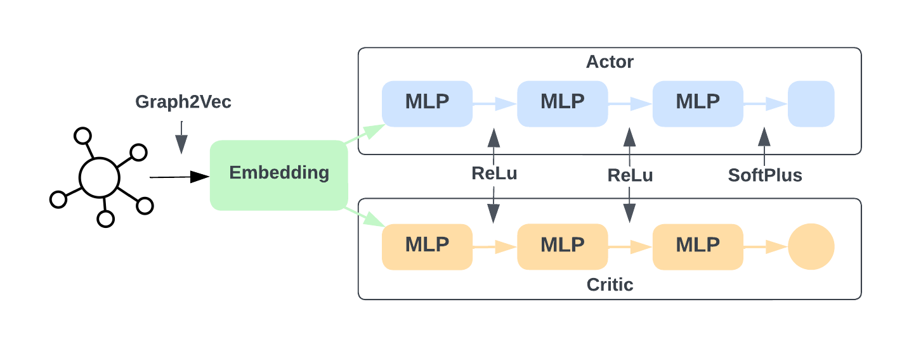

# Community Deception

## Introduction

This repository contains the code for the thesis "Community Deception" for the Master's Degree in Computer Science at Università La Sapienza di Roma.


In a nutshell, community deception aims to enable a target node within a graph to elude being recognized as a member of a particular node cluster, as determined by a community detection algorithm.
This objective is accomplished by granting the node in question the ability to strategically modify its connections with other nodes.
Therefore, our primary focus is on making changes to the graph's structure represented by the adjacency matrix. While the alteration of node features holds potential interest, that aspect is reserved for future exploration.

More formally, let $G (\mathcal{V}, \mathcal{E})$ be a graph and $f(\mathcal{G}) = \{\mathcal{C}_1,\ldots,\mathcal{C}_k\}$ denote the community arrangement derived from applying a detection algorithm $f(\cdot)$ to $\mathcal{G}$.
Furthermore, suppose that $f$ has identified node $u\in \mathcal{V}$ as a member of the community $\mathcal{C}_i\in f(\mathcal{G})$, denoted as $u\in \mathcal{C}_i$.
The aim of community deception is to formulate a function $h_{\theta}(\cdot)$, parametrized by $\theta$, that takes as input the initial graph $\mathcal{G}$ and produces as output a new graph $h_{\theta}(\mathcal{G}) = \mathcal{G'} = (\mathcal{V}, \mathcal{E'})$. Among all the possible graphs, we seek the one which, when input to the community detection algorithm $f$, disassociates a target node $u$ from its original community $\mathcal{C}_i$.

## Model Architecture



To tackle this problem, we have used the **Advantage Actor-Critic** (A2C) algorithm, a popular reinforcement learning technique that combines the advantages of both policy-based and value-based methods. It can be defined as:

```math
\nabla_{\theta} \mathcal{J} (\theta)  \sim \underset{t=0}{\overset{T-1}{\sum}} \nabla_{\theta} \text{log} \pi_{\theta} (a_t \vert s_t) A(s_t, a_t) \\ \text{with } A(s_t, a_t) = r_{t+1} + \gamma \mathcal{V}_v(s_{t+1}) - \mathcal{V}_v (s_t)
```

comprising two neural networks, one for the policy ($\pi_{\theta}$) and another for the value function estimator ($\mathcal{V}_v$), plus, in our case, an encoder for constructing a graph embedding:

- **Encoder**: The encoder serves as a pivotal component of the architecture, primarily due to the computational complexity of the graph, making it infeasible to directly utilize the adjacency matrix as input for the neural network. The encoder's role involves crafting a graph embedding, which will subsequently be used by the A2C neural networks for decision-making. It comprises a pre-trained *Graph2Vec* model that takes the graph's adjacency matrix as input and returns an embedding vector representing the graph's structure.
- **Policy (Actor)**: The policy is a neural network that takes the graph embedding as input and yields a probability distribution over actions to be undertaken. Specifically, the policy consists of two fully connected layers with ReLU activation functions and an output layer with SoftMax activation. The output layer has a dimension equal to the number of nodes in the graph, representing the probability distribution over actions. The policy is specifically trained to predict the probability that node $v$ is the optimal node to form the edge $(u, v)$, either to add or remove it, to hide node $u$ from its initial community. Depending on the input node $u$, the feasible actions are a subset of the graph's edges; hence, not all nodes $v \in V$ are potential actions for the policy.
- **Value (Critic)**: This network is nearly identical to the one used for the policy, with the only distinction being that the output layer has a dimension of $1$, representing the estimated value of the value function. The value function is trained to predict the state-value given a certain action $a$ and a state $s$.

## Requirements

To install requirements:

```bash
pip install -r requirements.txt
```

## Training

To train the model, run the following command:

```bash
python main.py --mode "train"
```

While, to test the model, run the following command:

```bash
python main.py --mode "test"
```

## References


### Code References

The A2C structure is a reimplementation of the code found in the following repository:

```bibtex
@inproceedings{GammelliYangEtAl2021,
  author = {Gammelli, D. and Yang, K. and Harrison, J. and Rodrigues, F. and Pereira, F. C. and Pavone, M.},
  title = {Graph Neural Network Reinforcement Learning for Autonomous Mobility-on-Demand Systems},
  year = {2021},
  note = {Submitted},
}
```

## Directory Structure

```bash
├── dataset
│   ├── archives                          # Contains the archives of the datasets   
│   │   └── ...
│   ├── data                              # Contains the datasets
│   │   └── ...
│   └── readme.md
├── notebook                              # Contains the notebooks used for the analysis
│   └── ...
├── references                            # Contains articles used for the thesis
│   └── ...
├── src                                   # Contains the source code
│   ├── agent                             # Contains the agent code
│   │   ├── a2c
│   │   │   ├── a2c.py
│   │   │   ├── actor.py
│   │   │   ├── critic.py
│   │   │   ├── graph_encoder.py
│   │   │   ├── __init__.py
│   │   │   ├── memory.py
│   │   │   └── readme.md
│   │   ├── agent.py
│   │   ├── __init__.py
│   │   └── readme.md
│   ├── community_algs                  # Contains algorithms for community analysis
│   │   ├── baselines                   # Contains the baselines for community deception
│   │   │   ├── degree_hiding.py
│   │   │   ├── random_hiding.py
│   │   │   ├── readme.md
│   │   │   └── roam_hiding.py
│   │   ├── metrics                     # Contains an implementation of the metrics used for the evaluation
│   │   │   ├── deception_score.py
│   │   │   ├── nmi.py
│   │   │   ├── permanence.py
│   │   │   └── safeness.py
│   │   ├── detection_algs.py           # Contains the community detection algorithms
│   │   ├── __init__.py
│   │   └── readme.md
│   ├── environment                     # Contains the environment of the agent
│   │   ├── graph_env.py
│   │   ├── __init__.py
│   │   └── readme.md
│   ├── logs                            # Contains the logs of the training
│   │   ├── ...
│   │   └── readme.md
│   ├── utils                           # Contains utility functions
│   │   ├── similarity.py               # Contains the functions to measure the similarity
│   │   ├── test.py                     # Contains the functions to test the model
│   │   └── utils.py                    # Contains constants and other utility functions
│   └── __init__.py
├── test                                # Contains the output of the test                    
│   ├── ....
│   └── readme.md
├── main.py                             # Main file, used to train and test the model                 
├── README.md
└── requirements.txt
```