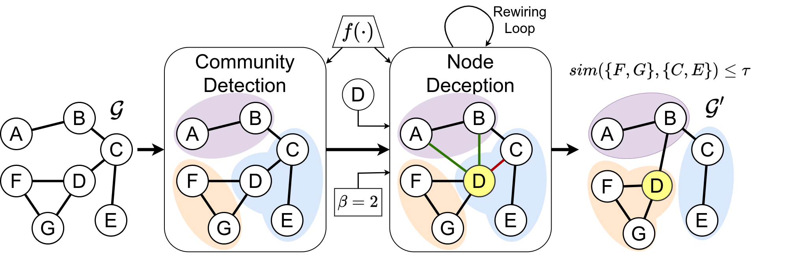

# Community Membership Hiding and Community Deception

## Introduction

In a nutshell, community membership hiding aims to enable a target node within a graph to elude being recognized as a member of a particular node cluster, as determined by a community detection algorithm.
This objective is accomplished by granting the node in question the ability to strategically modify its connections with other nodes.
Therefore, our primary focus is on making changes to the graph's structure, represented by the adjacency matrix. While the alteration of node features holds potential interest, that aspect is reserved for future exploration.

## Problem Formulation

Let $\mathcal{G} = (\mathcal{V}, \mathcal{E})$ be a graph and $f(\mathcal{G}) = \{\mathcal{C}_1,\ldots,\mathcal{C}_k\}$ denote the community arrangement derived from applying a detection algorithm $f(\cdot)$ to $\mathcal{G}$.
Furthermore, suppose that $f$ has identified node $u \in \mathcal{V}$ as a member of the community $\mathcal{C}_i \in f(\mathcal{G})$, i.e., $i^*_u$ denoted as $u \in \mathcal{C}_i$.


The aim of community membership hiding is to formulate a function $h_{\theta}(\cdot)$, parametrized by $\theta$, that takes as input the initial graph $\mathcal{G}$ and produces as output a *new* graph $h_{\theta}(\mathcal{G}) = \mathcal{G'} = (\mathcal{V}, \mathcal{E'})$. Among all the possible graphs, we seek the one which, when input to the community detection algorithm $f$, disassociates a target node $u$ from its original community $\mathcal{C}_i$. 

To achieve that goal, suppose that the target node $u$ is associated with a new community $\mathcal{C}'_i \in f(\mathcal{G}')$.
Hence, we can define the objective of community membership hiding by establishing a threshold for the similarity between $\mathcal{C}'_i$ and $\mathcal{C}_i$, excluding the target node $u$, which, by definition, belongs to both communities. In other words, we set a condition: $sim(\mathcal{C}_i \setminus \{u\}, \mathcal{C}'_i \setminus \{u\}) \leq \tau$, where $\tau \in [0,1]$.

We assume $sim(\cdot, \cdot)$ ranges between $0$ and $1$.

Several similarity measures can be used to measure $sim(\cdot, \cdot)$ depending on the application domain, e.g., the overlap coefficient (a.k.a. Szymkiewicz–Simpson coefficient), the Jaccard coefficient, and the Sorensen-Dice coefficient.



This diagram describes a simplification of the Node Deception process and its various phases. Given a graph $\mathcal{G}$, a node $u$ (in this case $u=E$), a budget of actions $\beta$, and the set of communities $\mathcal{C}$ identified by the community detection algorithm $f(\cdot)$ (including the community $\mathcal{C}_i$ to which the node belongs), the Node Deception process consists of adding inter-community edges $\mathcal{E}_{u,i}^+$ (green edges), or removing intra-community edges $\mathcal{E}_{u,i}^-$ (red edge), so that the value returned by the similarity function $sim(\cdot, \cdot)$, between the new community to which the node belongs after rewiring, and the original one, is lower than the $\tau$ constraint.

## Model


UMl diagram of the classes used in the project.


### Advantage Actor-Critic (A2C)

To learn the optimal policy for our agent defined above, we use the **Advantage Actor-Critic** (A2C) algorithm, a popular deep reinforcement learning technique that combines the advantages of both policy-based and value-based methods.
Specifically, A2C defines two neural networks, one for the policy ($\pi_{\theta}$) and another for the value function estimator ($V_v$), such that:

```math
\nabla_{\theta} \mathcal{J} (\theta)  \sim \underset{t=0}{\overset{T-1}{\sum}} \nabla_{\theta} \text{log} \pi_{\theta} (a_t \vert s_t) A(s_t, a_t) 
```
```math
\text{with } A(s_t, a_t) = r_{t+1} + \gamma \mathcal{V}_v(s_{t+1}) - \mathcal{V}_v (s_t)
```
where $\mathcal{J}(\theta)$ is the reward (objective) function, and the goal is to find the optimal policy parameters $\theta$ that maximize it. Instead, $A(s_t, a_t)$ is the advantage function, which quantifies how good or bad an action $a_t$ is compared to the expected value of taking actions according to the current policy.

Below, we describe the policy network (*actor*) and value function network (*critic*) separately.

#### Actor

The policy network is responsible for generating a probability distribution over possible actions based on the input, which consists of a list of nodes and the graph's feature matrix.
However, some graphs may lack node features. In such cases, we can extract continuous node feature vectors (i.e., node embeddings) with graph representational learning frameworks like `node2vec`. These node embeddings serve as the feature matrix.
%ensuring a consistent feature vector size, allowing the model to work with graphs of varying node counts.

Our neural network implementation comprises a primary graph convolution layer (GCNConv) for updating node features. The output of this layer, along with skip connections, feeds into a block consisting of three hidden layers. Each hidden layer includes multi-layer perception (MLP) layers, ReLU activations, and dropout layers. The final output is aggregated using a sum-pooling function. 
The policy is trained to predict the probability that node $v$ is the optimal choice for adding or removing the edge $(u, v)$ to hide the target node $u$ from its original community.
The feasible actions depend on the input node $u$ and are restricted to a subset of the graph's edges. Hence, not all nodes $v \in \mathcal{V}$ are viable options for the policy.

#### Critic

This network closely resembles the one employed for the policy, differing only in one aspect: it incorporates a global sum-pooling operation on the convolution layer's output. This pooling operation results in an output layer with a size of 1, signifying the estimated value of the value function. The role of the value function is to predict the state value when provided with a specific action $a_t$ and state $s_t$


Network architecture overview of the **Actor** and **Critic**. Initially, the node's continuous feature vectors are acquired by employing `node2vec`, subsequently modified through the graph convolutions and processed through non-linearities to establish the concentration parameters $\xi \in R^{|\mathcal{V}|}_+$ (i.e. correlated with the probability density on the shares) and the estimated value function $V(s_t)$.

## Requirements

First of all, install the requirements:

```bash
pip install -r requirements.txt
```

Then get the version of torch and cuda:

```python
import torch
import os

os.environ["TORCH"] = torch.__version__

# On Colab we can have TORCH+CUDA on os.environ["TORCH"]

# Check if there is the cuda version on TORCH
if torch.cuda.is_available():
    print("CUDA is available")
    print(torch.version.cuda)
    if "+" not in os.environ["TORCH"]:
        os.environ["TORCH"] += "+cu" + \
            torch.version.cuda.replace(".", "")

print(os.environ["TORCH"])
```

and finally install pytorch geometric:

```bash
! pip install torch_geometric
# Optional dependencies
! pip install pyg_lib torch_scatter torch_sparse -f <https://data.pyg.org/whl/torch-${TORCH}.html>
```


## Run the code

To train the model, run the following command:

```bash
python main.py --mode "train"
```
to modify the parameters of the model, please refer to the `src/utils/utils.py` file.

While, to test the model, run the following command:

```bash
python main.py --mode "test"
```
to modify the parameters of the model, please refer to the `main.py` file.

## References

The A2C structure is a reimplementation of the code found in the following repository:

```bibtex
@inproceedings{GammelliYangEtAl2021,
  author = {Gammelli, D. and Yang, K. and Harrison, J. and Rodrigues, F. and Pereira, F. C. and Pavone, M.},
  title = {Graph Neural Network Reinforcement Learning for Autonomous Mobility-on-Demand Systems},
  year = {2021},
  note = {Submitted},
}
```

all the other references are in the `references` folder.

## Directory Structure

```bash
├── dataset
│   ├── archives                            # Contains the archives of the datasets 
│   │   └── ...
│   ├── data                                # Contains the datasets
│   │   └── ...
│   └── readme.md
├── images                                  # Images used in the README
│   └── ...
├── notebook                                # Contains the notebooks used for the analysis
│   └── ...                           
├── references                              # Contains articles used for the thesis
│   └── ...                           
├── src                                     # Contains the source code
│   ├── agent
│   │   ├── a2c                             # Contains the agent code
│   │   │   ├── a2c.py
│   │   │   ├── actor.py
│   │   │   ├── critic.py
│   │   │   ├── __init__.py
│   │   │   └── readme.md
│   │   ├── agent.py
│   │   ├── __init__.py
│   │   └── readme.md
│   ├── community_algs                      # Contains algorithms for community analysis
│   │   ├── baselines
│   │   │   ├── community_hiding            # Community Deception algorithms
│   │   │   │   ├── __init__.py
│   │   │   │   ├── modularity.py
│   │   │   │   ├── modularity_test.py
│   │   │   │   ├── permanence.py
│   │   │   │   ├── safeness.py
│   │   │   │   └── safeness_tets.py
│   │   │   ├── node_hiding                 # Node Deception algorithms
│   │   │   │   ├── degree_hiding.py
│   │   │   │   ├── __init__.py
│   │   │   │   ├── random_hiding.py
│   │   │   │   └── roam_hiding.py
│   │   │   ├── __init__.py
│   │   │   └── readme.md
│   │   ├── metrics                         # Contains an implementation of the metrics used for the evaluation
│   │   │   ├── deception_score.py
│   │   │   ├── nmi.py
│   │   │   ├── readme.md
│   │   │   └── similarity.py
│   │   ├── detection_algs.py               # Contains the community detection algorithms
│   │   ├── __init__.py
│   │   └── readme.md
│   ├── environment                         # Contains the environment of the agent
│   │   ├── graph_env.py
│   │   ├── __init__.py
│   │   └── readme.md
│   ├── models                              # Contains the trained models
│   │   └── ...
│   ├── utils                               # Contains utility functions
│   │   ├── hiding_community.py
│   │   ├── hiding_node.py
│   │   ├── __init__.py
│   │   ├── readme.md
│   │   └── utils.py
│   └── __init__.py
├── test                                    # Contains the output of the test
│   └── ...
├── main.py
├── README.md
└── requirements.txt
```
